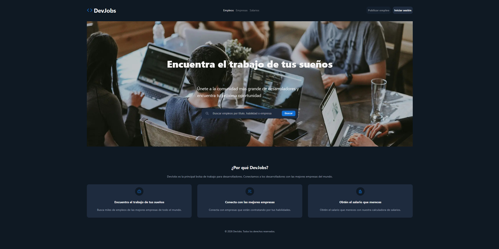
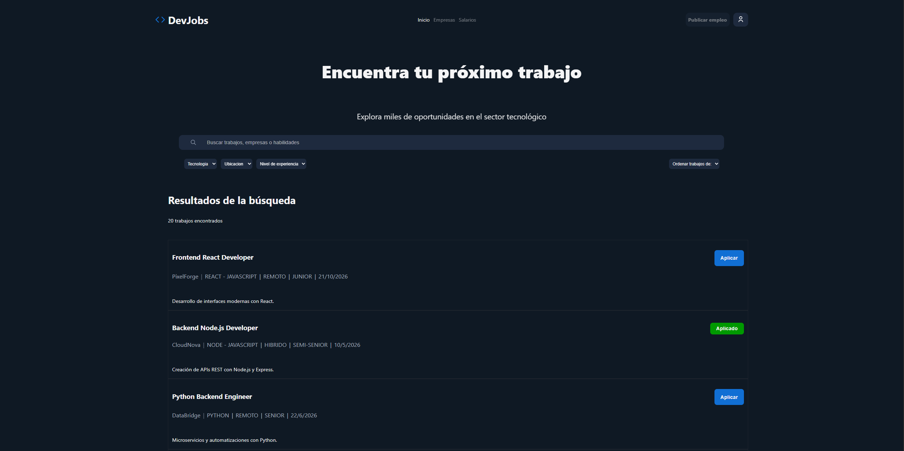
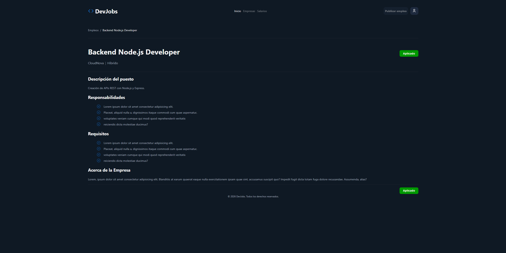
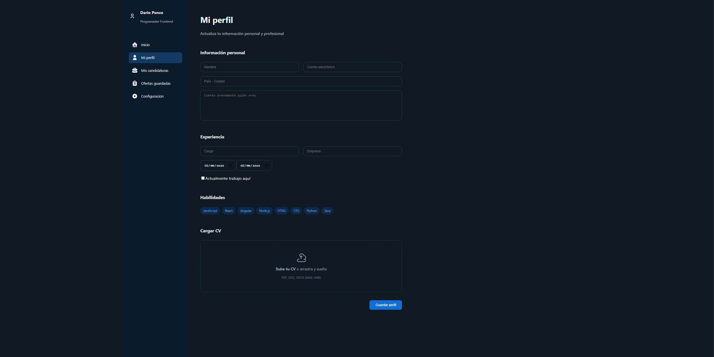

# DevJobs — Job Board para Desarrolladores

Aplicación web tipo bolsa de empleo enfocada en desarrolladores. Permite buscar, filtrar y explorar ofertas laborales con una experiencia moderna y dinámica.

---

## 🚀 Demo

👉 (agregá acá tu link deploy cuando lo tengas)

---

## ✨ Features

* 🔍 Búsqueda en tiempo real (con debounce)
* 🎯 Filtros por tecnología, ubicación y experiencia
* 📊 Ordenamiento dinámico (empresa, fecha, seniority)
* 📄 Vista detallada de cada empleo
* 💾 Persistencia en LocalStorage (empleos aplicados)
* 🔄 Sincronización entre vistas (lista ↔ detalle)
* 📄 Paginado optimizado
* 🌐 URL sincronizada con filtros (query params)

---

## 🛠️ Tecnologías

* React
* React Router
* Hooks personalizados (useDebounce, useFilters)
* JavaScript (ES6+)
* CSS moderno (Flexbox, Grid, variables, responsivo)

---

## 🧠 Decisiones técnicas

* Uso de `useMemo` para optimizar filtros y ordenamientos
* Separación de lógica en hooks reutilizables
* Manejo de estado centralizado para filtros y búsqueda
* Sincronización de estado con URL para mejor UX

---

## 📂 Estructura del proyecto

```
src/
  components/
  pages/
  hooks/
  styles/
```

---

## ⚙️ Instalación

```bash
git clone https://github.com/DaroPonce21/DevJobs
npm install
npm run dev
```

---

## 📸 Screenshots

| Home | Empleos |
|------|--------|
|  |  |

| Detalle | Perfil |
|--------|-------|
|  |  |

---
## 📌 Estado del proyecto

MVP funcional enfocado en frontend.

---

## 🎯 Objetivo

Este proyecto forma parte de mi proceso de crecimiento como desarrollador frontend, aplicando buenas prácticas y construyendo aplicaciones reales.

---

## 👤 Autor

Daro Ponce
